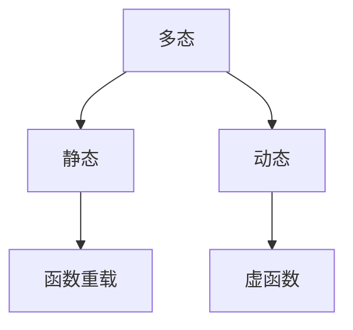

<center><h2>C++学习</h2></center>

> 巩固与学习 C++ ，只会记录不懂的、不熟悉和没见过的知识

## 🎉 目录

1. [**第一章:C++概述**](#C++概述)

   1. [枚举 enum](#枚举enum)
   2. [函数重载](#函数重载)
   3. [面向对象的三大特性](#面向对象的三大特性)
   4. [引用](#引用)
   5. [内联函数和普通函数](#内联函数和普通函数)
   6. [常量指针和指针常量](#常量指针和指针常量)
   7. [C++多态](#c多态)
   8. [多态实现](#多态实现)
   9. [虚函数](#虚函数)
   10. [重写和重载的区别](#重写和重载的区别)
   11. [指针与动态分配内存的结合](#指针与动态分配内存的结合)
   12. [指针与静态分配的内存](#指针与静态分配的内存)

2. [**第二章:C++数据结构**](#c数据结构)

   1. [线性表](#线性表)
      1. [定义](#定义)
      2. [特点](#特点)
   2. [顺序表](#顺序表)

3. [**第三章:C++相关用法**](#C相关用法)

---

## C++概述

### 枚举 enum

```c++
enum Direction{North , South ,East ,West}
```

当 C++编译器遇到该类型定义时，它会按常量名的顺序，从 0 开始给每个常量赋值。因此 NORTH 被赋值为 0，EAST 被赋值为 1，SOUTH 被赋值为 2，WEST 被赋值为 3。C++允许你给每个枚举类型的常量显示地赋值。例如，以下类型声明:

```c++
enum Coin
{
PENNY =1 ,
NICKEL =5 ,
DIME =10,
QUARTER=25,
HALF_DOLLAR=50,
DOLLAR =100
};
```

引人了一个表达美国货币的枚举类型，其中每一个常量定义了相应硬币的货币价值。如果你给枚举类型中的一些而非全部常量提供了初值，那么 C++编译器会自动地给未赋值的常量赋以一个你所提供的最后一个常量值的后继整数值。

<details>
<summary>示例</summary>

```C++
#include <iostream>

enum Day {
    Sunday,     // 默认值为 0
    Monday,     // 默认值为 1
    Tuesday,    // 默认值为 2
    Wednesday,  // 默认值为 3
    Thursday,   // 默认值为 4
    Friday,     // 默认值为 5
    Saturday    // 默认值为 6
};

int main() {
    Day today = Wednesday;  // 将枚举变量赋值为 Wednesday
    std::cout << "Today is day number: " << today << std::endl;  // 输出 3
    return 0;
}

```

</details>

### 函数重载

在 C++中，函数名相同但函数的参数列表不同是合法的。当编译器遇到调用函数的函数名指代不唯一的情况时，编译器会检查调用函数时所传实参并选择最适合的函数版本。

```c++
int abs(int x)
{

}

int abs(float x){

}
```

### 面向对象的三大特性

`封装` `继承` `多态`

- `封装`:将对象的属性和方法绑定在一起，形成一个独立、封闭的单元。外部只能通过对象提供的 API 接口访问/操作对象的内部状态。而无法直接访问或者修改对象的数据。

- `继承`:一个类可以从另一个类继承某些属性和方法，在基础上添加新的属性和方法

- `多态`:同一个消息可以被不同对象解释执行，做出不同的响应。一般通过虚函数和模板等机制实现。

### 引用

`&a = b`
改变 a 也会改变 b
操作类似于指针，但是引用不能被赋值为 NULL，也不能进行指针运算。

**C/C++引用和指针的区别？**

指针是一个实体，需要`分配内存空间`；引用只是变量的别名，`不需要分配内存空间`。引用在定义的时候`必须进行初始化`，并且`不能够改变`；指针在定义的时候`不一定要初始化`，并且`指向的空间可变`。

### 内联函数和普通函数

> 当调用一个普通函数时，程序控制会跳转到函数的地址执行代码，执行完后返回调用点。这个跳转过程有一定的开销

内联函数的主要目的是为了`减少函数调用时的开销`。
通过使用` inline 关键字`，建议编译器将函数的代码直接插入到调用点，而不是进行传统的函数调用跳转。
这样做可以`减少函数调用的开销`，尤其是对`非常小的、频繁调用的函数`。

**内联函数的特点：**

- 通过减少函数调用的开销提升性能，尤其是对小型函数。
- 编译器可能会拒绝内联过于复杂或较大的函数。
- 适用于短小、简单的函数，如访问器、数学计算等。

**内联函数的使用注意事项**

- `代码膨胀`:如果多个内联函数被多个地方调用，编译器会在每个调用点插入函数的代码，导致生成的可执行文件体积增大。
- `递归函数`:递归函数通常不适合内联，因为递归调用可能导致无限循环的内联展开。
- `复杂函数`:过于复杂的函数不适合内联，编译器可能会自动忽略 inline。

### 常量指针和指针常量

#### 常量指针

在`C`语言中，常量指针的定义方式为`const int* ptr`，表示指向 int 类型的常量指针，例如

```c++
int main() {
    int a = 20;
    int b = 10;
    int const *ptr ;
    ptr = &b;
    cout<<ptr<<"  "<<&ptr<<"  "<<*ptr<<endl;    //0x62fe1c  0x62fe10  10

    ptr = &a;
    cout<<ptr<<"  "<<&ptr<<"  "<<*ptr<<endl;    //0x62fe1c  0x62fe10  20

    return 0;
}
```

- ptr：指针 ptr 的值，也就是 b 的地址。
- &ptr：指针 ptr 本身的地址。
- \*ptr：指针 ptr 指向的值，也就是 b 的值（这里为 10）。

#### 指针常量

而指针常量的定义方式为`int* const ptr`，表示指向 int 类型的指针常量，指针所指向的地址可以改变，但是不能通过指针修改地址对应的值。

### 野指针

> 野指针是指指向已经`被释放`或者`无效的内存空间的指针`，这是 C++ 中常见的一个程序错误。当我们访问野指针时，程序会出现不可预期的行为，甚至崩溃。

**避免野指针，我们可以采取以下措施:**

- 指针使用前初始化

```C++
int* p = nullptr; // 初始化为空指针
```

- 指针使用后及时置空

当指针变量不再使用时，我们应该将其置为空指针，防止误用。这样可以有效地避免产生野指针。

```c++
int* p = new int;
*p = 10;
delete p;
p = nullptr;  // 置空指针，避免野指针产生
```

- 不要重复释放已经释放的内存

在释放指针所指向的内存空间之后，我们应该将该指针赋值为 `NULL` 或 `nullptr`，以防止该指针被误用。

```c++
int* p = new int;
delete p;
p = nullptr;  // 置空指针，避免野指针产生// 以下代码会产生错误，因为指针 p 已经被释放delete
```

- 避免使用悬空指针

当一个指针变量超出了其所在作用域或者被删除时，它就成为了“悬空指针”，这是一种常见的野指针。

### C++多态

假设你是一位公司经理，你手下有不同类型的员工，例如“程序员”和“设计师”。你告诉他们去“工作”，但每个员工的工作内容其实不一样。程序员写代码，而设计师画图。

多态就是这样一种能力：虽然你发出的命令是一样的——让他们“工作”，但根据员工的具体类型，他们的工作方式是不同的。程序员做程序员的事，设计师做设计师的事。这就是多态：`相同的指令，表现出不同的行为`。

在 C++ 中，父类（比如“员工”）提供了一个虚函数 work()，子类（比如“程序员”和“设计师”）分别重写了这个函数，具体执行不同的工作内容。当你使用一个指向父类的指针或者引用时，程序会根据实际的子类类型来决定调用哪个 work() 函数。

<details>

```c++

#include <iostream>
using namespace std;

class Employee {
public:
    // 虚函数，父类定义了“工作”这个动作
    virtual void work() {
        cout << "Employee is working." << endl;
    }
};

class Programmer : public Employee {
public:
    // 子类“程序员”重写了“工作”函数
    void work() override {
        cout << "Programmer is coding." << endl;
    }
};

class Designer : public Employee {
public:
    // 子类“设计师”重写了“工作”函数
    void work() override {
        cout << "Designer is drawing." << endl;
    }
};

int main() {
    Employee* e1 = new Programmer();  // 使用父类指针指向程序员对象
    Employee* e2 = new Designer();    // 使用父类指针指向设计师对象

    e1->work();  // 调用的是程序员的 work()，输出：Programmer is coding.
    e2->work();  // 调用的是设计师的 work()，输出：Designer is drawing.

    delete e1;
    delete e2;

    return 0;
}

```

</details>

### 多态实现



### 虚函数

`虚函数`：在类的成员函数前加`virtual`关键字。
在基类中定义为 virtual，在派生类中可以重写（`override`）。

```C++
class Person
{

public:
	virtual void BuyTicket()
	{

		cout << "买票-全价" << endl;
	}
};
```

虚函数的实现依赖于`虚函数表（vtable）`和`虚函数指针（vptr）`。每个包含虚函数的类都会有一个虚函数表，表中保存了该类的`虚函数地址`。对象在创建时，会有一个指向虚函数表的指针。通过这个指针，程序能够在运行时根据`对象的实际类型`找到`对应的虚函数`并调用它。

### 重写和重载的区别

重写（Override） 和 重载（Overload） 是两个不同的概念，尽管它们都涉及到函数的使用。

`重写（Override）`
重写发生在`继承关系`中，是运行时`多态`的一部分。`派生类`对从`基类继承`的`虚函数进行重写`，以提供不同的实现。

`重载（Overload）`
重载发生在同一个作用域内，指的是同一作用域中的`函数名相同`但`参数列表不同`。重载主要用于在`同一个类`中定义多个同名函数，但它们的参数类型、数量或顺序不同。重载的函数可以有不同的返回类型，`但返回类型本身不能用来区分重载函数。`

### 指针与动态分配内存的结合

```C++
int* p = new int;  // 动态分配一个 int 型的内存，并用指针 p 指向它
*p = 10;           // 给动态分配的内存赋值
cout << *p << endl; // 输出动态分配内存中的值：10
delete p;          // 释放动态分配的内存
p = nullptr;       // 避免悬空指针
```

- `int* p` 是一个指针，存储`动态分配`的`内存的地址`。
- `new int` 在`堆`上动态分配了一个 `int 类型的内存`，并返回该`内存的地址`，存储在`指针 p `中。
- 通过` *p`，我们可以`访问并修改`该内存中的值。
- 使用完内存后，调用 `delete p` 释放动态分配的内存。

### 指针与静态分配的内存

```C++
int x = 5;
int* p = &x;  // 指针 p 指向变量 x 的地址
cout << *p << endl;  // 输出 5
```

在这个例子中，`指针 p `指向的是`静态分配的栈上变量 x 的地址`，而不是`动态分配的内存`。静态分配的内存会在其作用域`结束时自动释放`，`不需要手动释放`。

### 智能指针

> 本质是一个封装了一个原始 C++指针的类模板，为了确保动态内存的安全性而产生的。实现原理是通过一个对象存储需要被自动释放的资源，然后依靠对象的析构函数来释放资源。
> std::auto_ptr 是 C++98 中引入的一种智能指针，但在 C++11 中被弃用，并在 C++14 中正式移除。auto_ptr 提供了类似于 unique_ptr 的功能，但有一些重要的缺点，使其在现代 C++ 中不再推荐使用。

**目前三种：**

1. std::unique_ptr
2. std::shared_ptr
3. std::weak_ptr。

std::unique_ptr 表示独占所有权的智能指针。它不能被复制，只能被移动，这样可以确保同一时间只有一个 unique_ptr 指向一个对象。

```c++
#include <iostream>
#include <memory>

int main() {
    std::unique_ptr<int> p1(new int(10)); // 创建 unique_ptr
    std::cout << *p1 << std::endl; // 输出: 10

    // std::unique_ptr<int> p2 = p1; // 错误：不能复制
    std::unique_ptr<int> p2 = std::move(p1); // 移动所有权
    // p1 不再有效
    if (!p1) {
        std::cout << "p1 is now nullptr." << std::endl; // 输出: p1 is now nullptr.
    }

    return 0; // p2 超出作用域时自动释放内存
}
```

std::shared_ptr 允许多个指针共享同一个对象的所有权。它使用引用计数来跟踪指向同一对象的 shared_ptr 的数量，当最后一个 shared_ptr 被销毁时，内存才会被释放。

```c++
#include <iostream>
#include <memory>

int main() {
    std::shared_ptr<int> p1(new int(20)); // 创建 shared_ptr
    {
        std::shared_ptr<int> p2 = p1; // 共享所有权
        std::cout << *p2 << std::endl; // 输出: 20
        std::cout << p1.use_count() << std::endl; // 输出: 2
    } // p2 超出作用域，引用计数减少

    std::cout << p1.use_count() << std::endl; // 输出: 1

    return 0; // p1 超出作用域时自动释放内存
}

```

std::weak_ptr 是一种弱引用智能指针，旨在与 std::shared_ptr 一起使用。它不会增加引用计数，因此不会阻止对象的销毁。weak_ptr 主要用于解决循环引用的问题。

```c++
#include <iostream>
#include <memory>

class Node {
public:
    std::shared_ptr<Node> next;
    int value;
    Node(int val) : value(val) {}
};

int main() {
    std::shared_ptr<Node> p1(new Node(1));
    std::shared_ptr<Node> p2(new Node(2));

    p1->next = p2; // p1 指向 p2
    p2->next = p1; // p2 指向 p1，形成循环引用

    std::weak_ptr<Node> wp = p1->next; // 使用 weak_ptr 指向 p2
    std::cout << "Use count before reset: " << wp.use_count() << std::endl; // 输出: 2

    p1.reset(); // 释放 p1，p2 不会被释放
    std::cout << "Use count after p1 reset: " << wp.use_count() << std::endl; // 输出: 1

    if (auto sp = wp.lock()) { // 尝试获取 shared_ptr
        std::cout << sp->value << std::endl; // 输出: 2
    } else {
        std::cout << "p2 is no longer available." << std::endl;
    }

    return 0; // 最终 p2 会被释放
}

```

### 匿名函数 Lambda

它允许你定义一个没有名称的函数对象，可以直接在需要的地方使用。

```c++
 #include <iostream>
#include <vector>
#include <algorithm>

int main() {
    // 创建一个 Lambda 表达式并使用它
    auto sum = [](int a, int b) {
        return a + b;
    };

    std::cout << "Sum: " << sum(5, 3) << std::endl; // 输出: Sum: 8

    // 使用 Lambda 表达式作为函数对象
    std::vector<int> vec = {1, 2, 3, 4, 5};
    int total = 0;

    // 在 STL 算法中使用 Lambda 表达式
    std::for_each(vec.begin(), vec.end(), [&total](int n) {
        total += n; // 累加
    });

    std::cout << "Total: " << total << std::endl; // 输出: Total: 15

    return 0;
}


```

### C++ extern

**作用** :声明一个已经在别处定义的变量，函数或者类的引用。
比如，如果在一个.cpp 文件中定义了一个`全局变量int globalVar = 10`;，那么在另一个.cpp 文件中可以通过使用`extern int globalVar`;来引用这个全局变量，从而可以使用它的值。

此外，`extern`关键字可用于`跨文件共享`函数或类定义。在一个.h 文件中定义类后，可在多个.cpp 文件中用`extern`声明引用，以访问类成员函数。

**添加 extern 的简单用法**

```c++
// file1.cpp
int globalVar = 10; // 定义全局变量

// file2.cpp
#include <iostream>

// 声明外部变量
extern int globalVar;

int main() {
    std::cout << "Global variable: " << globalVar << std::endl; // 输出: Global variable: 10
    return 0;
}
```

### malloc 和 new 的区别

`malloc()` 是 C 语言中的一个函数，用于在堆上分配内存。它返回一个指针，指向分配的内存块的起始位置。
`new` 是 C++ 语言中的一个运算符，用于在堆上分配内存。它返回一个指针，指向分配的内存块的起始位置。

**释放**
`malloc()`分配的内存必须使用`free()`来释放，否则会造成内存泄漏。
`new`分配的内存需要使用`delete`来释放，否则会造成内存泄漏。

`delete 释放内存前会调用析构函数，释放对象。`

`free只是简单地释放指针所指向的内存块。`
因为 malloc() 是 C 语言提供的函数，C 语言没有析构函数，所以需要手动释放。

不过，C++ 提供了一些智能指针（如` std::weak_ptr` 和 `std::unique_ptr` 和 `std::shared_ptr`）来帮助自动管理内存，这些智能指针可以在对象不再需要时自动释放内存。

### C++堆和栈的区别

堆存放动态分配的对象，`生存期由程序控制`；`栈`用来保存定义在函数内的`非static`对象，仅在其定义的`程序块运行时才存在`；静态内存用来保存`static对象`，`类static`数据成员以及定义在任何函数外部的变量，static 对象在使用之前分配，程序结束时销毁；`栈和静态内存`的对象由编译器自动创建和销毁。

### static

1. 局部静态变量
   - 作用域:
     - 仅在声明它的函数内部可见。
   - 生命周期:
     - 从第一次被初始化时开始，直到程序结束。
   - 初始化:
     - 只在第一次进入其作用域时初始化一次。

```c++
    void func() {
        static int count = 0;
        count++;
        std::cout << "Count: " << count << std::endl;
    }
```

2. 全局静态变量

- 作用域:
  - 仅在声明它的文件内可见，不能被其他文件访问。
- 生命周期:
  - 从程序开始到程序结束。
- 初始化:
  - 在程序启动时初始化。

```c++

// file1.cpp
static int globalVar = 10;

// file2.cpp
// int globalVar; // 错误：file2 无法访问 file1 中的 globalVar

```

3. 静态成员变量

- 作用域:

  - 在类的所有对象之间共享。

- 生命周期:

  - 从程序开始到程序结束。

- 初始化:
  - 必须在类外部初始化。

```c++

class MyClass {
public:
    static int sharedVar;
};

int MyClass::sharedVar = 0; // 初始化
```

4. 静态成员函数

- 作用域:
  - 可以访问类的静态成员变量和其他静态成员函数。
- 生命周期:
  - 与类的生命周期相同。
- 调用方式:
  - 可以通过类名或对象调用。

```c++
class MyClass {
public:
    static int sharedVar;
    static void setSharedVar(int value) {
        sharedVar = value;
    }
};

int MyClass::sharedVar = 0; // 初始化

int main() {
    MyClass::setSharedVar(10);
    std::cout << MyClass::sharedVar << std::endl;
    return 0;
}
```

5. 静态局部函数
- 作用域:
    - 仅在声明它的文件内可见，不能被其他文件访问。
- 生命周期:
    - 与普通函数相同。

```c++

// file1.cpp
static void helperFunction() {
    // 函数实现
}

// file2.cpp
// void helperFunction(); // 错误：file2 无法访问 file1 中的 helperFunction
```

---

## C++数据结构

### 线性表

#### 定义

`线性表`是`n个元素组成的有序序列`，`n=0称空表`

#### 特点

1. 存在唯一的一个被称做“`第一个`”的数据元素
2. 存在唯一的一个被称做“`最后一个`”的数据元素
3. 除第一个元素之外，集合中的每个数据元素均只有一个`直接前趋`
4. 除最后一个元素之外，集合中的每个数据元素均只有一个`直接后继`

### 顺序表

> 在计算机中用一组连续的存储单元依次表示线性表中各
> 元素的一种存储结构。
