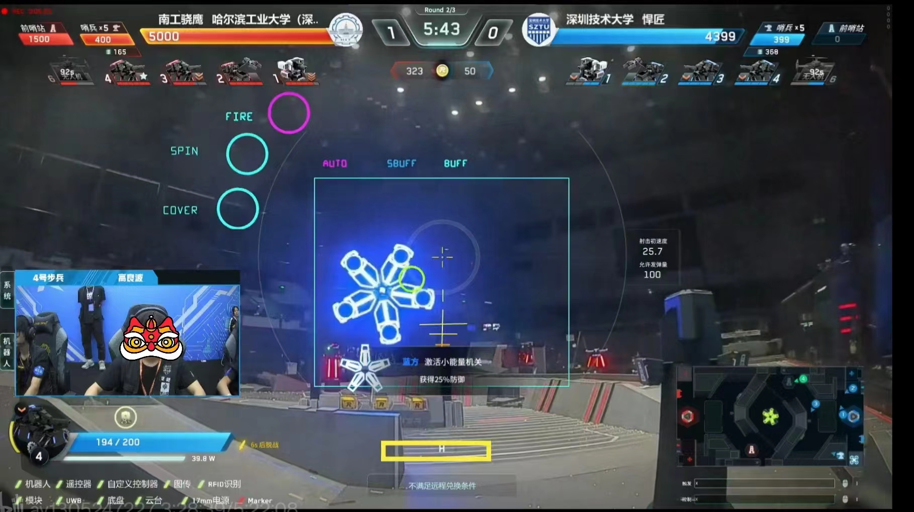
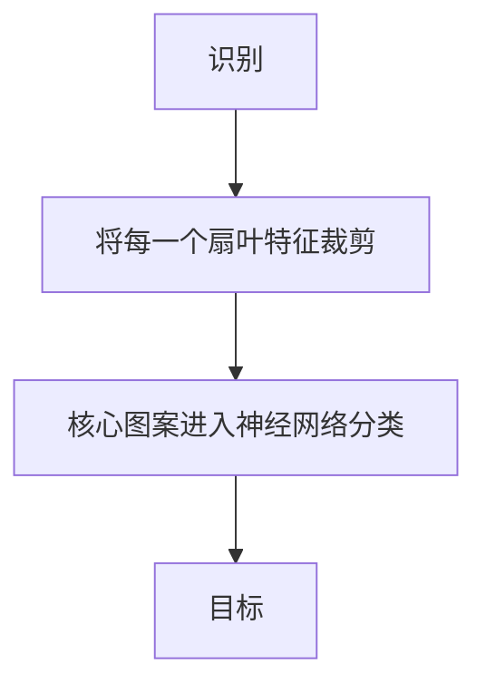
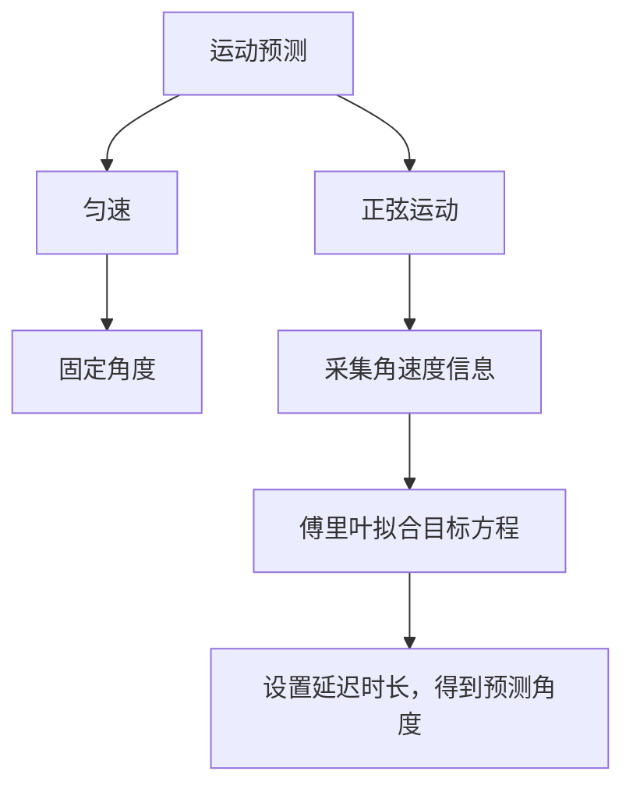
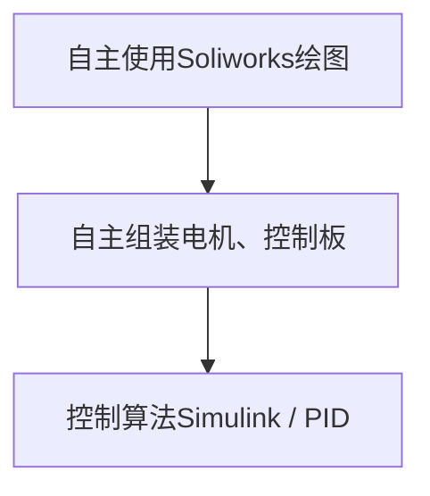
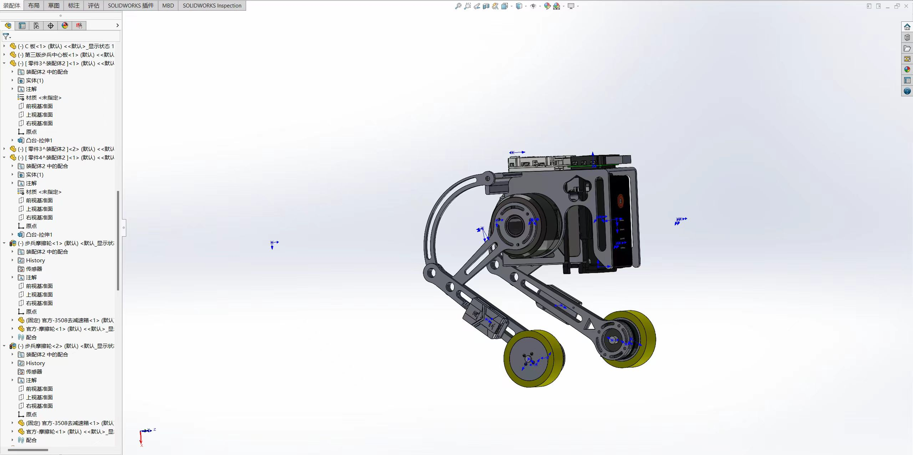
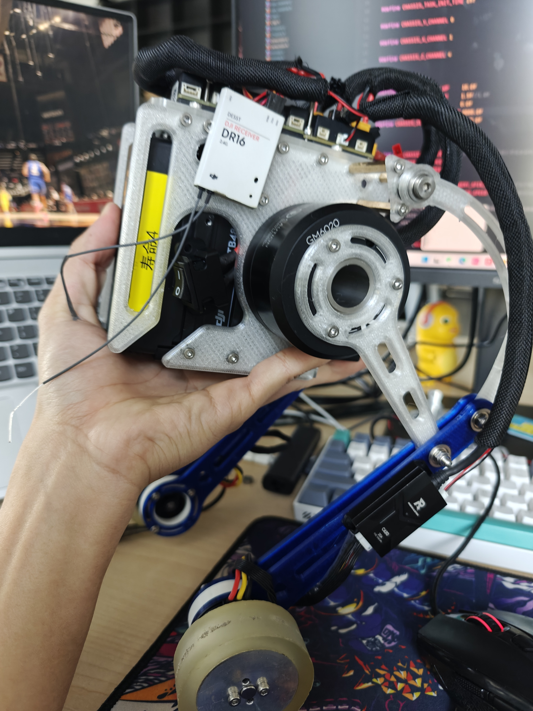

<center><h2>Project Summary</h2></center>

大学三年的项目经历是有`机器人识别与跟踪预测视觉算法`、`轮腿机器人`、`基于多元线性规划的种植策略问题求解`、`基于深度学习的细胞分类与分割`以及`前端与数据库结合的企业资源规划系统`


<center><h3>最主要的三个项目经历</h3> </center>

- [机器人识别与跟踪预测视觉算法 C++](#机器人识别与跟踪预测视觉算法)

- [轮腿机器人 Matlab&simulink](#轮腿机器人)

- [基于多元线性规划的种植策略问题求解 Matlab](#基于多元线性规划的种植策略问题求解)

---

### 机器人识别与跟踪预测视觉算法

#### 项目背景：



**RoboMaster比赛有一个装置为：能量机关。类似Buff ,激活能量机关装置，为队伍获取增益。因此完成此项目对队伍实力提升是很重要的。但是`新版能量机关识别与预测`成为技术难题**


#### 项目攻克：

`时间有限，粗略概括`

**识别**



**预测**



#### 项目可视化
<video width="100%" height="80%" controls>
  <source src="https://github.com/user-attachments/assets/6f0700aa-6c86-446e-a70a-2b5157fbbb08" type="video/mp4">
</video>


<video width="100%" height="80%" controls>
  <source src="../image/步兵_连续5次激活大能量机关.mp4" type="video/mp4">
</video>


### 轮腿机器人

#### 项目研发过程



 

 
<video width="100%" height="80%" controls>
  <source src="../image/bcarroll.mp4" type="video/mp4">
</video>
<video width="100%" height="80%" controls>
  <source src="../image/bcarroll2.mp4" type="video/mp4">
</video>

<video width="100%" height="80%" controls>
  <source src="../image/bcarSimulink.mp4" type="video/mp4">
</video>

``` Cpp

void LQRController_info_get()
{
    //TODO:分左右腿控制  K为LQR输出的最优控制矩阵
    lqrController.u_l= - (
            lqrController.K[0] * leg_L.x_pose +             // 位移量
            lqrController.K[1] * leg_L.x_speed +            // 速度量
            lqrController.K[2] * (robotState.angle_x - robotState.Target_angle_x)+ // 角度偏移量
            lqrController.K[3] * robotState.gyro_x);        // 角速度变化量

    lqrController.u_r= - (
            lqrController.K[0] * leg_R.x_pose +
            lqrController.K[1] * leg_R.x_speed +
            lqrController.K[2] * (robotState.angle_x - robotState.Target_angle_x)+
            lqrController.K[3] * robotState.gyro_x);
}

```
 
