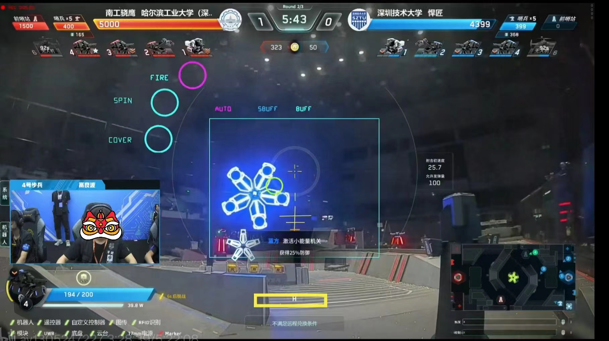
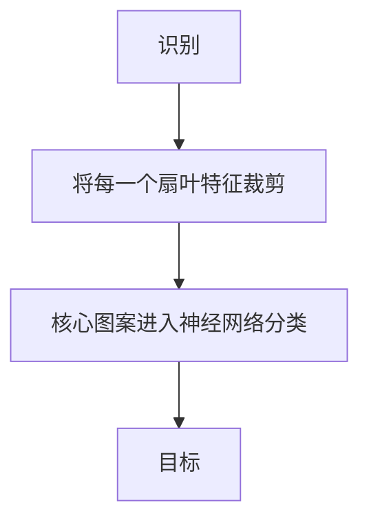
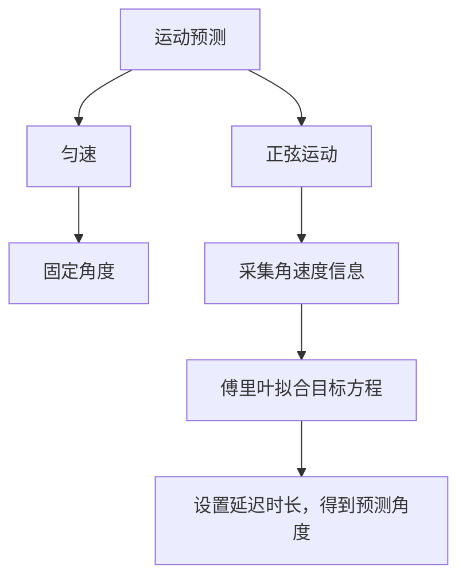
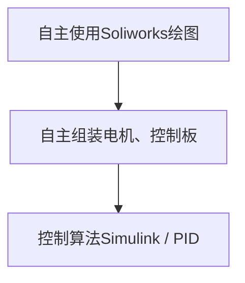
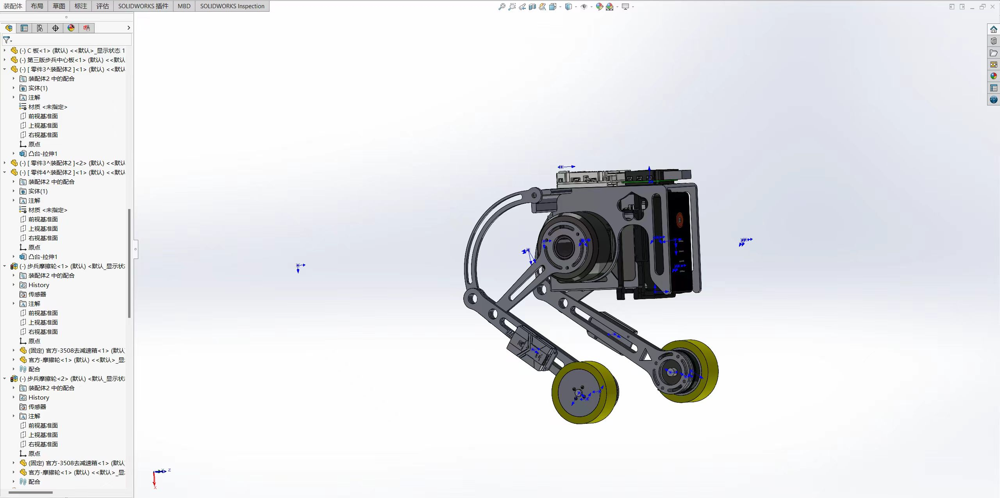
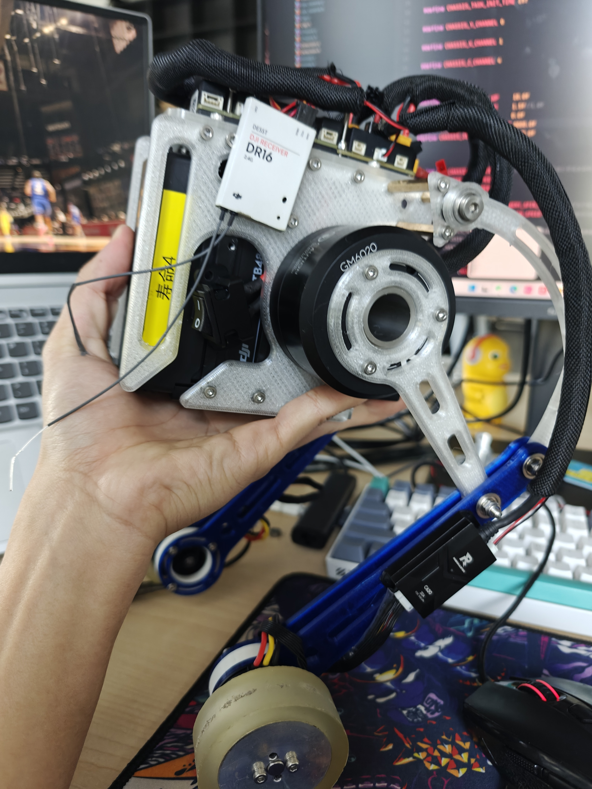

<center><h1>核心项目</h1></center>

大学三年的项目经历是有`机器人识别与跟踪预测视觉算法`、`轮腿机器人`、`基于多元线性规划的种植策略问题求解`、`基于深度学习的细胞分类与分割`以及`前端与数据库结合的企业资源规划系统`


<center><h3>最主要的三个项目经历</h3> </center>

- [机器人识别与跟踪预测视觉算法 C++](#机器人识别与跟踪预测视觉算法)

- [轮腿机器人 Matlab&simulink](#轮腿机器人)

~~- [基于多元线性规划的种植策略问题求解 Matlab](#基于多元线性规划的种植策略问题求解)~~

---


<center><h4>机器人识别与跟踪预测视觉算法</h4></center>


<center><h4>项目背景</h4></center>
 




<br><br><br> 

> **RoboMaster比赛有一个装置为：能量机关。类似Buff ,激活能量机关装置，为队伍获取增益。因此完成此项目对队伍实力提升是很重要的。但是`新版能量机关识别与预测`成为技术难题**

<center><h4>项目攻克</h4></center>
 

!>时间有限，粗略概括

<center><h5>识别</h5></center>


<br><br>


```c++
std::vector<BuffTarget> BuffDetection::Detection(cv::Mat &frame_) {

    /**
    * @brief 对图像初步增强、采用图像分割、膨胀和均值滤波 等
    * @param  加上膨胀、滤波操作时间消耗长
    * @return  返回二值化图像
    */

    SetImage(frame_);
 
    
    /**
     * @brief 对用到的变量开关/容器初始化
     */
    Detection_Init();
    
    
    
    /**
     * @brief 1.寻找初始轮廓 2.将符合初筛条件的轮廓 分别进入R 与 leaf 的筛选中
     * @param candidateRect_Buff结构体是在robot_struct定义的_将识别信息传到预测类里面
     */

    findCandidateRect(binary);

    
    /**
       * @brief 应对可能出现两个目标（新目标已经出现，旧目标还没有来得及切换图案的时候）
       * @param 判断对于的位置与R标的距离
       */
    Get_final_buff();


    /**
     * @brief 可视化数据
     */
    show(frame_);


#ifdef SHOW_IMAGE
    cv::imshow("frame_" , frame_);
    cv::imshow("binary",binary);

#endif
    
    return final_buff_target;

}
```

<br>
<details>
<summary>模型推理代码</summary>

```c++
bool BuffDetection::classifier(cv::Mat &src, size_t id, std::string &ModePath) {
    double confidence;
    size_t classId;
    // 加载ONNX模型

    cv::dnn::Net net = cv::dnn::readNetFromONNX(ModePath);

    // 将图像转换为blob
    cv::Mat blob = cv::dnn::blobFromImage(src, 1.0, cv::Size(30, 30), cv::Scalar(), true, false);

    // 设置网络的输入
    net.setInput(blob);

    // 进行前向传播以获取输出
    cv::Mat prob = net.forward();

    // 找到概率最高的类别
    cv::Point classIdPoint;
    minMaxLoc(prob.reshape(1, 1), nullptr, &confidence, nullptr, &classIdPoint);

    classId = classIdPoint.x;

    if (classId == id && confidence * 100 > leaf_classifier_confidence) {
        blob.release();
        prob.release();
        return true;
    } else {

        blob.release();
        prob.release();
        return false;
    }
}
```
</details>

<br><br>

<center><h5>预测</h5></center>



<center><h5>项目可视化</h5></center>

<div style="text-align: center;">
    <video width="50%" height="50%" controls>
        <source src="https://github.com/user-attachments/assets/6f0700aa-6c86-446e-a70a-2b5157fbbb08" type="video/mp4">
        Your browser does not support the video tag.
    </video>
    <video width="50%" height="50%" controls >
        <source src="./image/步兵_连续5次激活大能量机关.mp4" type="video/mp4">
    </video>
</div>


<center><h3>轮腿机器人</h3></center>

>整体的机械结构自主设计，单片机与电机均为大疆机甲大师系列产品，控制算法是基于开源的仿真模型进行修改。 

<center><h4>项目研发过程</h4></center>
 




 

<br><br><br>
 


<br><br>

!>因为开发过程不是再调参的路上就是在调参的路上，基本很少拍视频来记录。

<div style="text-align: center;">
  <video width="30%" controls>
    <source src="./image/bcarroll.mp4" type="video/mp4">
  </video>
  <video width="30%" controls>
    <source src="./image/bcarroll2.mp4" type="video/mp4">
  </video>
</div>
  <br><br>
  <video width="100%" controls muted>
    <source src="./image/bcarSimulink.mp4" type="video/mp4">
  </video>

<br><br>

```c++
void LQRController_info_get()
{
    //TODO:分左右腿控制  K为LQR输出的最优控制矩阵
    lqrController.u_l= - (
            lqrController.K[0] * leg_L.x_pose +             // 位移量
            lqrController.K[1] * leg_L.x_speed +            // 速度量
            lqrController.K[2] * (robotState.angle_x - robotState.Target_angle_x)+ // 角度偏移量
            lqrController.K[3] * robotState.gyro_x);        // 角速度变化量

    lqrController.u_r= - (
            lqrController.K[0] * leg_R.x_pose +
            lqrController.K[1] * leg_R.x_speed +
            lqrController.K[2] * (robotState.angle_x - robotState.Target_angle_x)+
            lqrController.K[3] * robotState.gyro_x);
}

```
 
 
 