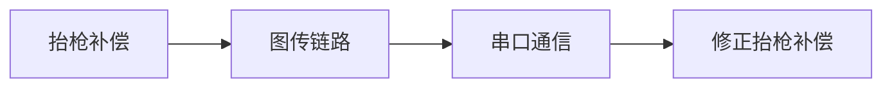
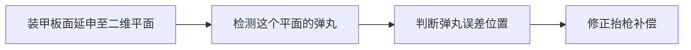
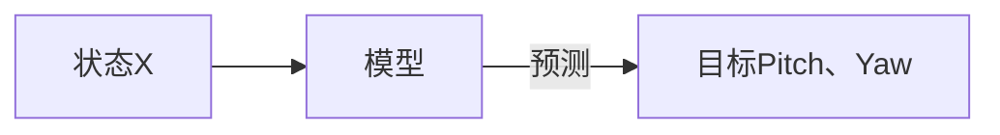

# **场上调整抬枪补偿**
>因为场外测好的抬枪补偿信息不一定实际上有实际效果，因此需要我们研发一种可以实现场上也可以调整抬枪补偿的方案。
 
---

#### *影响抬枪补偿的因素*
1. **温度： 在冬天的时候，由于摩擦轮转速变慢的原因，抬枪补偿也会变化。**
2. **枪管和C板相对位置：毋庸置疑**
3. **摩擦轮接触不良，只有一个转**
4. **弹丸摩擦和摩擦轮摩擦系数**
5. .....

#### *问题的本质*
- <u>**曝光导致的轮廓变粗导致PnP测距变化。（最主要）**</u>
- **赛前拆头（最为致命）**
- ......
---
### 解决方案

#### 1.操作手场上调整抬枪补偿

##### 方案分析
1. 可靠性强
2. 实现简单
3. 会花费10s钟
4. 比赛的时候紧张，来不及调整。

##### 实现过程

<h3>示例</h3>

1. 操作手发现击打不准，知道偏移位置。
2. 操作手按下某个键/组合键 ，进入调抬枪补偿模式（该模式底盘断电
3. w a s d 键作为对应的补偿量 (如：连续点击w , 抬枪补偿pitch + 正固定量 表示枪管往上抬)。a左,s下,d右,w上
4. 按下指定键退出模式。
5. (ps:进入调抬枪补偿模式，可以打自己人，辅助纠正)

#### 2.检测弹道落点
##### 方案分析
1. 难实现（首先识别到弹丸难、其次是判断是散布还是其他情况）
2. 不太稳定（弹丸小、速度快，误识别可能高。其次小电脑算力不够）
3. 误差大 （你也不知道这个弹丸你打的还是对面的）

##### 实现过程

#### 3.机器学习仿真弹道模型
##### 方案分析
1. 需要收集左右摩擦轮转速
2. 相对距离
3. 相对高度
4. 温度
5. 返回Pitch Yaw
6. 数据量大（测的东西多、拆一下头要白费）

##### 实现过程
|需要收集参数    |单位| 关系|
|---------------|----|---|
|左摩擦轮转速    |rpm |输入|
|右摩擦轮转速    |rpm |输入|
|  相对位置      |  m |输入|
|相对高度        |  m |输入|
|当前温度        |  ℃ |输入|
|打中状态下的Pitch|°  |输出 训练时作为输入|
|打中状态下的Yaw |  °  |输出 训练时作为输入|

---
 
